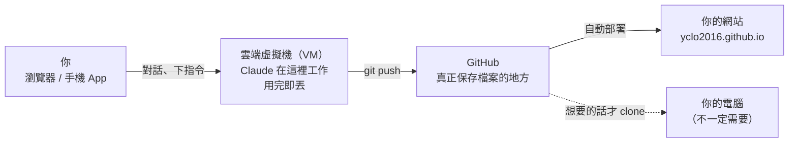

## 這篇文章的例子：就是你正在看的這個網站

這個部落格本身就是用雲端 Claude Code（Claude Code on the web）做出來的。

起點是一個**完全空的 GitHub 儲存庫（Repository，簡稱 repo）**。我沒有在自己的電腦上安裝任何東西，只在瀏覽器裡跟 Claude 對話。Claude 在雲端幫我：

1. 研究要用什麼部落格架構（最後選了 Jekyll + Chirpy 主題）
2. 建好整個網站，並設定自動部署
3. 研究「雲端 Claude Code 怎麼用」，寫成你正在讀的這篇文章

所以這篇文章教的每一步，都是這個網站實際經歷過的。讀完之後，你可以用同樣的方法建立自己的網站、研究自己有興趣的主題。

> **本文資訊**：撰寫於 2026 年 9 月，內容依據 [Claude Code 官方文件](https://code.claude.com/docs/en/claude-code-on-the-web)。產品介面可能會改變，若和你看到的畫面不同，請以官方文件為準。
{: .prompt-info }

---

## 先搞懂一件事：程式碼到底跑在哪裡？

我剛開始用的時候最困惑的就是這個問題：「Claude 說它改好檔案、推上 GitHub 了，可是這些檔案在我電腦的哪裡？」

**答案是：不在你的電腦上。**



- **雲端虛擬機（Virtual Machine，VM）**：每次開始新的工作階段（Session），Anthropic 會準備一台全新的 Ubuntu 機器，把你的 repo 複製（clone）進去，Claude 就在裡面讀檔、改檔、執行指令。這台機器閒置一段時間後會被回收，**沒推上 GitHub 的東西都會消失**。
- **GitHub**：唯一真正保存成果的地方。Claude 會把改動推到一個分支（Branch），你在 GitHub 上審核、合併。
- **你的電腦**：完全不需要。如果想要本地副本，再用 `git clone` 或 GitHub Desktop 下載即可。

> **原來可以這麼想**
>
> 傳統的 AI 程式助手像「坐在你旁邊的顧問」：它在你的電腦上工作，你得一直開著電腦盯著它。
> 雲端 Claude Code 比較像「有自己辦公室和電腦的同事」：你交代任務之後就可以關掉筆電去吃飯，它會繼續做，做完把成果交到 GitHub 上。**你的角色從「操作者」變成「交代任務和驗收的人」。**
{: .prompt-tip }

---

## 一次性設定（約 5 分鐘）

### 你需要準備

| 項目 | 說明 |
|---|---|
| Claude 付費方案 | Pro、Max、Team，或有對應席位的 Enterprise |
| GitHub 帳號 | 免費帳號即可 |
| 一個 GitHub repo | 可以是空的。要做個人網站的話，名稱取 `你的帳號.github.io` |

### 步驟 1：建立 repo（要做網站才需要）

1. 到 <https://github.com/new>
2. **Repository name** 輸入 `你的帳號.github.io`（例如本站是 `yclo2016.github.io`）
3. 選 **Public**（免費帳號的 GitHub Pages 只支援公開 repo）
4. **不要**勾選任何初始化選項（README、.gitignore、license），直接按 **Create repository**

### 步驟 2：連接 GitHub

1. 打開 <https://claude.ai/code> 並登入
2. 依照畫面提示按 **Sign in with GitHub**，在 GitHub 的授權頁面按同意
3. 如果要讓 Claude 處理**私有（private）repo**，或使用後面會介紹的 **Auto-fix**，需要再[安裝 Claude GitHub App](https://github.com/apps/claude/installations/new)，並在安裝畫面勾選你的 repo

### 步驟 3：確認雲端環境（Environment）

Pro 和 Max 方案會自動建立一個叫 **Default** 的環境。Team 和 Enterprise 方案則會出現一個表單，保留預設值按 **Create & finish** 即可。

環境決定了 Claude 的虛擬機能連到哪些網站，也就是**網路存取（Network access）**：

| 等級 | 能連到哪裡 | 適合 |
|---|---|---|
| **None** | 除了 Anthropic API，什麼都連不到 | 最高安全需求 |
| **Trusted**（預設） | 常見套件庫（npm、PyPI、RubyGems…）、GitHub、雲端服務 | 大部分情況 ✅ |
| **Full** | 任何網站 | 需要大量上網查資料時 |
| **Custom** | 你自己列的網域清單 | 需要連到特定服務時 |

建這個網站時，Default（Trusted）已經足夠。Jekyll 需要的套件從 RubyGems 下載，就在允許清單裡。

> **原來可以這麼想**
>
> 網路權限是一種**信任邊界**，要多少開多少就好。例如你想讓 Claude 研究某個特定網站的內容，可以用 Custom 只加那一個網域，而不是直接開 Full。
{: .prompt-tip }

---

## 場景一：從一個空 repo 到上線的網站（本站就是這樣誕生的）

### 步驟 1：開始工作階段

1. 在 <https://claude.ai/code> 的輸入框下方，點 **repo 選擇器**，選你的 repo
2. 輸入框旁邊有**權限模式（Permission mode）**下拉選單：
   - **Auto**：由分類器替你審核 Claude 的動作，最省事（組織有開放且模型支援時才會出現）
   - **Accept edits**：Claude 直接修改並推送，不停下來問
   - **Plan**：Claude 先提出計畫，你同意後才開始改
3. 第一次建議選 **Plan**，可以先看它打算怎麼做

### 步驟 2：第一句話就交代「目標、讀者、限制」，並請它先問你問題

以下的對話範例是依照本站實際建站過程整理、改寫的「更好版本」。每一則都附上**它為什麼有效**，你可以直接套用到自己的專案。

先比較兩種開場：

| 普通的問法 | 更好的問法 |
|---|---|
| 「幫我做一個部落格。」 | 說清楚要拿來做什麼、給誰看、有什麼限制，並請它先提方案、先問問題 |

更好的問法實際長這樣：

```text
這個 repo 是空的，我想把它做成個人網站。

用途：當我對某個主題有興趣時，請你做研究，寫成一步一步可以照著做的教學。
讀者：我自己，以及對同樣主題好奇、但不一定有技術背景的人。
語言：繁體中文，專有名詞中英對照。

限制：
- 我不想在自己的電腦上安裝任何東西，全部要能在雲端完成
- 不想付主機費

請先不要動手。給我 2～3 個可行方案，比較優缺點，推薦一個並說明理由。
如果有什麼資訊需要我補充，先列出問題問我。
```

**為什麼有效**：

- **用途和讀者**讓 Claude 知道要挑什麼。「教學文」代表需要文章目錄、程式碼區塊、提示框；「不一定有技術背景」代表寫法要淺白。
- **限制**會直接排除不適合的方案。「不裝軟體、不付費」幾乎就指向 GitHub Pages。
- **「先不要動手」**讓它先跟你對齊方向，不會一開始就做了一堆你不要的東西。
- **「先問我問題」**會讓那些你沒想到的決定浮上來，例如網站標題、顯示名稱、要不要公開。

本站就是這樣選出了 **Jekyll + Chirpy 主題**：GitHub Pages 原生支援、免費，而且文章目錄、程式碼高亮、提示框、流程圖和全站搜尋都是內建的。

> **原來可以這麼想**
>
> 把 Claude 當成**你請來的顧問**，而不是自動販賣機。好顧問的第一步是問問題，所以你可以直接邀請它問你。
> 你不需要先搞懂所有技術才能開始。你只需要清楚知道**自己要什麼、不要什麼**，技術選擇交給它提案，決定權留在你手上。
{: .prompt-tip }

### 步驟 3：告訴它「怎樣才算完成」，讓它自己驗收

決定好方案之後，交代任務時一定要附上**完成的標準**：

```text
就用 Chirpy。請幫我：
1. 建好網站：標題「AI Research Notes」，作者顯示「YC」，介面繁體中文
2. 設定 GitHub Actions：合併到 main 後自動部署，每個 PR 也要先建置並檢查連結
3. 寫第一篇文章，主題是「在雲端使用 Claude Code」

完成的標準：
- 在你的機器上執行 jekyll build 成功，htmlproofer 檢查沒有壞掉的連結
- 文章中每個操作步驟都附上官方文件作為依據
- 推送前先截圖首頁和文章頁，確認畫面正常
- 最後列出這篇文章裡你最不確定、我應該自己驗證的三個地方
```

**為什麼有效**：

- Claude 在雲端有**自己的電腦**，可以真的執行建置、檢查連結、打開瀏覽器截圖。你寫出標準，它就會自己跑一遍，發現問題自己修，而不是交給你一個「應該可以動」的東西。
- **最後一條**特別好用：AI 不會主動告訴你它哪裡沒把握，但你問了它就會說。這讓你知道該把驗證的力氣花在哪裡。

> **原來可以這麼想**
>
> 「幫我做 X」只說了**要做什麼**；「做到 Y 才算完成」則說了**怎樣算做好**。後者讓 AI 能自己檢查、自己修正，你從「逐行檢查的人」變成「只看結果的驗收者」。
{: .prompt-tip }

### 步驟 4：中途修正方向，要說具體

Claude 工作時，你**不用等它做完才能說話**。發現方向不對就直接補一句，它會在下一步把你的意見納入考量。

但修正要具體。比較這兩種說法：

```text
文章寫得更好一點。
```

```text
第一篇文章的方向要調整：
- 例子請改用「本站自己的建置過程」，不要用虛構的待辦清單 App
- 每個場景最後加一個提示框，說明背後的思維轉換，
  讓讀者不只學會操作，也知道為什麼這樣做更好
- 其他部分維持不變
```

**為什麼有效**：第二種說法講清楚了四件事：**要改什麼**（例子、提示框）、**改成什麼**（本站的真實過程）、**為什麼**（讓讀者理解背後的想法），以及**哪些不要動**。最後一點常被忽略，但它能避免 AI 為了改一個地方，把原本好的部分也改掉。

> **原來可以這麼想**
>
> 給 AI 回饋，跟給同事回饋一樣：「不夠好」沒有人知道要怎麼改；「這裡改成這樣，因為……，其他保留」才能一次到位。
{: .prompt-tip }

### 步驟 5：把規則寫進 `CLAUDE.md`，讓以後的每個工作階段都記得

每個雲端工作階段都是一台全新的機器，**Claude 不會記得上一次的對話**。那要怎麼讓它每次都用繁體中文、都中英對照、都用真實例子？

答案是在 repo 根目錄放一個 `CLAUDE.md` 檔案。它是 repo 的一部分，所以每次 clone 都會被帶進去，Claude 開始工作時會自動讀取。本站的 [`CLAUDE.md`](https://github.com/yclo2016/yclo2016.github.io/blob/main/CLAUDE.md) 節錄如下：

```markdown
## 隱私（最重要）
- 這是公開 repo。文章、設定檔、提交訊息中不可以出現密碼、金鑰、
  站長的個人資料、帳號設定或私人對話內容。

## 語言
- 一律使用繁體中文（台灣用語），不要使用簡體中文。
- 專有名詞第一次出現時中英對照，例如「工作階段（Session）」。

## 文章規則
- 教學文必須用真實、有意義的例子，不要為了示範而編造的例子。
- 在關鍵處加入「原來可以這麼想」的提示框，說明背後的思維轉換。
```

> **原來可以這麼想**
>
> `CLAUDE.md` 就是**給未來每一個 Claude 的交接文件**。你只要寫一次偏好，以後在網頁、手機或排程裡開的任何工作階段都會遵守。
> 反過來說，只存在你電腦上的設定（例如 `~/.claude/` 裡的東西）雲端是看不到的。**想讓雲端知道，就把它 commit 進 repo。**
{: .prompt-tip }

### 步驟 6：審核、合併、上線

1. Claude 做完後，畫面上會出現像 `+820 -0` 的**差異指示（Diff indicator）**，點下去可以看每個檔案改了什麼
2. 如果有意見，在該行點一下直接留言，下一則訊息送出時會一起交給 Claude
3. 滿意後按上方的 **Create PR** 建立拉取請求（Pull Request，PR），到 GitHub 上按 **Merge** 合併到 `main`
4. **只需要做一次**：到 repo 的 **Settings → Pages**，把 **Source** 改成 **GitHub Actions**
5. 到 repo 的 **Actions** 分頁，看到「Build and Deploy」變成綠色勾勾之後，打開 `https://你的帳號.github.io`，網站就上線了 🎉

> **空 repo 的小陷阱**：在完全空的 repo 裡，**第一個被推上去的分支會自動變成預設分支**。如果那是 Claude 的工作分支（例如 `claude/xxx`），而不是 `main`，你可以到 **Settings → General → Default branch** 改掉，或請 Claude 先建立 `main` 再開 PR。本站就遇到了這個情況。
{: .prompt-warning }

---

## 場景二：通勤時用手機派一份研究作業

網站架好之後，最常做的事就是「我對 X 有興趣 → 請 Claude 研究 → 寫成文章」。這件事**用手機就能完成**。

1. 打開 Claude 手機 App（[iOS](https://apps.apple.com/us/app/claude-by-anthropic/id6473753684) / [Android](https://play.google.com/store/apps/details?id=com.anthropic.claude)），切到 **Code** 分頁
2. 選擇你的部落格 repo
3. 輸入研究任務，例如：

```text
請研究「GitHub Actions 是什麼、能幫一個個人部落格做什麼」，
以本站自己的 .github/workflows/pages-deploy.yml 為實際例子，
逐段解釋它在做什麼，寫成一篇教學文章放進 _posts/。
依照 CLAUDE.md 的寫作規則，完成後建立 PR。
```

4. 鎖上手機，去做別的事
5. 回來後打開同一個工作階段，看 Claude 寫了什麼。滿意就建立 PR 並合併，網站會自動更新

> **原來可以這麼想**
>
> 注意這個任務用的例子是**本站的部署檔**（`pages-deploy.yml`）。它是這個網站用來自動建置和上線的公開檔案，本來就放在公開的 repo 裡，不含任何個人資訊。與其讓 AI 用一個虛構的範例解釋 GitHub Actions，不如請它解釋「這個網站實際在用的那個檔案」。你會同時學到概念，也真的看懂了自己的網站。
>
> 手機因此變成了**指揮中心**：想法冒出來的那一刻就能派出去，不用等回到電腦前。
{: .prompt-tip }

> **公開 repo 裡的一切都是公開的**
>
> GitHub Pages 的免費方案要求 repo 是公開的，所以 repo 裡的每個檔案、每一筆提交紀錄（Commit）任何人都看得到。請 Claude 寫文章時，**不要**把這些東西放進去：
> - 密碼、API 金鑰、存取權杖（Token）
> - 個人資料：本名、Email、電話、住址、工作單位
> - 你自己電腦或帳號的詳細設定、私人對話內容
>
> 最保險的做法是把這條規則寫進 `CLAUDE.md`，每次工作時 Claude 都會遵守。本站的 `CLAUDE.md` 就有這條規則。
{: .prompt-danger }

---

## 場景三：一次派出三個研究員

每個工作階段都是**獨立的機器、獨立的分支**，所以你可以同時開好幾個，它們不會互相干擾。

例如你正在考慮要不要學某個新技術，可以同時開三個工作階段：

| 工作階段 | 任務 |
|---|---|
| A | 研究「Astro 與 Jekyll 做部落格的差別」，寫成比較表 |
| B | 研究「如何在 Chirpy 加上留言功能（giscus）」，寫成教學 |
| C | 研究「如何為部落格加上自訂網域」，寫成教學 |

在 claude.ai/code 開三個新工作階段、各貼一個任務，然後關掉瀏覽器。之後回來，三個 PR 都在等你審核。

如果你習慣用終端機（Terminal），也可以這樣派：

```bash
claude --cloud "研究 Astro 與 Jekyll 做部落格的差別，寫成比較表文章"
claude --cloud "研究如何在 Chirpy 加上 giscus 留言功能，寫成教學"
claude --cloud "研究如何為 GitHub Pages 加上自訂網域，寫成教學"
```

> **原來可以這麼想**
>
> 以前「研究一個主題」是循序的：查完 A 才能查 B。現在你可以把問題拆開，**同時**交給好幾個研究員，你只負責最後的比較和判斷。
> 瓶頸不再是研究時間，而是**你能不能把問題問清楚**。
{: .prompt-tip }

> **用量提醒**：雲端工作階段和你其他的 Claude 使用共用同一個用量額度（Rate limit）。同時開越多，額度消耗越快。雲端虛擬機本身不另外收費。
{: .prompt-warning }

---

## 場景四：部署失敗？讓 Claude 自己修好

本站的 GitHub Actions 在每個 PR 上都會自動做兩件事：**建置網站**，並用 `htmlproofer` **檢查所有內部連結**。只要文章裡有一個壞掉的連結，檢查就會失敗（CI 變紅燈）。

以前遇到這種情況，你得自己打開紀錄（Log）找錯誤、修正、再推送。現在可以打開 **Auto-fix**：

1. 在建立 PR 的那個工作階段裡，打開 **CI 狀態列**，選 **Auto-fix**
   - 或是直接跟 Claude 說：「幫我盯著這個 PR，CI 失敗或有審核留言就修好它」
2. Claude 會訂閱這個 PR 的 GitHub 事件
3. 當檢查失敗時，Claude 會自己去讀錯誤紀錄、找出壞掉的連結、修好並推送，直到檢查通過

> 前提：Auto-fix 需要在 repo 上安裝 [Claude GitHub App](https://github.com/apps/claude)。
{: .prompt-info }

> **原來可以這麼想**
>
> 自動化檢查（CI）原本是**攔住人類犯錯的關卡**。有了 Auto-fix，它變成 **Claude 的品質驗收標準**：你定義「什麼叫做好」（連結不能壞、網站要能建置），Claude 負責反覆修正直到達標。
> 所以**你寫下的檢查越多，AI 能獨立完成的工作就越可靠**。這也是本站特地讓 PR 也跑檢查的原因。
{: .prompt-tip }

---

## 場景五：讓教學文自己保持最新

技術教學最大的問題是**會過時**。工具更新了、按鈕改名了，文章卻停在半年前。

**例行任務（Routines）** 可以讓 Claude 按照排程自動執行任務。你可以設定每週檢查一次這篇文章：

1. 打開 <https://claude.ai/code/routines>，按 **New routine**
2. 名稱：`每週檢查 Claude Code 教學是否過時`
3. 提示詞（Prompt）要寫得完整，因為它會在沒有人監督的情況下執行：

```text
請閱讀 _posts/2026-09-24-use-claude-code-in-the-cloud.md，
並和以下官方文件的最新內容比對：
- https://code.claude.com/docs/en/claude-code-on-the-web
- https://code.claude.com/docs/en/web-quickstart
- https://code.claude.com/docs/en/cloud-environments
- https://code.claude.com/docs/en/routines

如果文章中有任何步驟、按鈕名稱、方案或限制已經和官方文件不一致，
請依照 CLAUDE.md 的規則修正文章，並在文章開頭的「本文資訊」更新檢查日期，
然後建立 PR，在 PR 描述中逐條列出改了什麼、依據哪一段官方文件。
如果沒有任何需要修改的地方，就不要建立 PR。
```

4. 選擇 repo 和環境。要讓 Claude 讀取 `code.claude.com`，需要把該網域加進環境的允許清單：編輯環境，**Network access** 選 **Custom**，在 **Allowed domains** 加入 `code.claude.com`，並勾選 **Also include default list of common package managers**
5. 在 **Select a trigger** 選 **Schedule** → **Weekly**
6. 按 **Create**。想馬上試一次，可以在詳細頁面按 **Run now**

之後每週，如果文章過時了，你會收到一個附上修改說明的 PR。沒有過時就什麼都不會發生。

> **原來可以這麼想**
>
> 一般的文章寫完就「死了」。有了例行任務，文章變成**會自我維護的活文件**：你不只是請 AI 寫一次，而是請它**持續負責**。
> 同樣的思路可以用在很多地方，例如每週整理某個領域的新消息、每月檢查網站有沒有壞掉的外部連結。
{: .prompt-tip }

> 例行任務目前是研究預覽（Research preview）功能，每個帳號每天能執行的次數有上限。最短的排程間隔是一小時。
{: .prompt-info }

---

## 場景六：把雲端的工作接回自己的電腦

有時候雲端做到一半，你想在自己電腦上接手，例如用本機預覽網站、自己微調文字。這時可以用**傳送（Teleport）**：

```bash
# 在你電腦上這個 repo 的資料夾裡執行，會列出雲端工作階段讓你選
claude --teleport
```

Claude Code 會自動抓取該工作階段的分支、切換過去，並載入**完整的對話紀錄**，你可以從雲端停下的地方繼續。

幾個前提：
- 本機要先 clone 同一個 repo，且沒有未提交的修改（有的話它會提示你先暫存）
- 本機的 Claude Code 要用同一個 claude.ai 帳號登入
- 接回本機後，新的工作只存在本機，不會同步回雲端

---

## 限制與注意事項

| 項目 | 說明 |
|---|---|
| 閒置回收 | 工作階段閒置一段時間後，虛擬機會被回收。重新打開時會準備新機器並恢復對話，但**未推送的檔案和背景程序不會保留** |
| 只保存 repo 裡的東西 | 你電腦上的設定、套件、`~/.claude/` 都不會帶到雲端。想用就 commit 進 repo |
| 需要 GitHub | clone 和建立 PR 都要透過 GitHub |
| 資源上限 | 約 4 vCPU、16 GB RAM、30 GB 硬碟 |
| 用量共用 | 和你其他的 Claude 使用共用額度 |
| 分享工作階段 | Pro/Max 可以設為 Public，任何登入 claude.ai 的人都看得到。分享前要檢查內容有沒有敏感資訊 |

---

## 回顧：這篇文章真正想說的事

| 以前的想法 | 原來可以這麼想 |
|---|---|
| AI 是坐在旁邊的顧問 | AI 是有自己電腦、可以獨立工作的同事 |
| 要先搞懂技術才能開始 | 說清楚目標、讀者、限制，請 AI 先提方案、先問你問題 |
| 「幫我做 X」 | 「做 X，做到 Y 才算完成」，讓 AI 自己驗收 |
| 「寫得更好一點」 | 說清楚改什麼、改成什麼、為什麼、哪些不要動 |
| 用虛構的例子學習 | 用你手上真實的東西當例子 |
| 每次都要重新交代偏好 | 寫一次 `CLAUDE.md`，以後所有工作階段都遵守 |
| 研究一件做完再做下一件 | 同時派出好幾個研究員 |
| CI 是攔住犯錯的關卡 | CI 是 AI 的驗收標準，檢查越多越可靠 |
| 文章寫完就不管了 | 用例行任務讓文章自我維護 |

---

## 術語對照表

| 中文 | 英文 | 說明 |
|---|---|---|
| 儲存庫 | Repository（repo） | 放專案所有檔案和歷史紀錄的地方 |
| 分支 | Branch | 同一個 repo 裡平行的修改路線 |
| 拉取請求 | Pull Request（PR） | 請求把某個分支的修改合併進主線 |
| 工作階段 | Session | 一次和 Claude 的完整對話與工作 |
| 虛擬機 | Virtual Machine（VM） | 雲端上的一台獨立電腦 |
| 環境 | Environment | 雲端工作階段的設定：網路權限、環境變數、安裝腳本 |
| 持續整合 | Continuous Integration（CI） | 每次修改時自動建置和檢查 |
| 例行任務 | Routine | 按排程、API 或 GitHub 事件自動執行的 Claude 任務 |
| 傳送 | Teleport | 把雲端工作階段接回本機終端機 |

## 參考資料

- [Use Claude Code in the cloud](https://code.claude.com/docs/en/claude-code-on-the-web)
- [Get started with Claude Code in the cloud](https://code.claude.com/docs/en/web-quickstart)
- [Configure cloud environments](https://code.claude.com/docs/en/cloud-environments)
- [Automate work with routines](https://code.claude.com/docs/en/routines)
- [Chirpy 主題](https://github.com/cotes2020/jekyll-theme-chirpy)
